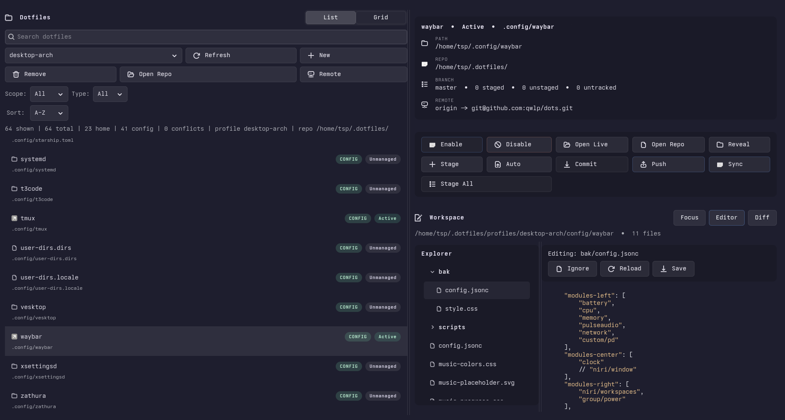

# doot

A simple GTK4 GUI for managing dotfiles with Git.



## Features

- Visual management of dotfiles in `~` and `~/.config`
- Git-based versioning and sync
- Symlink management for active/inactive states

## Build

```bash
cargo build --release
```

## Run

```bash
cargo run
```

## Requirements

- GTK4 development libraries
- Git
